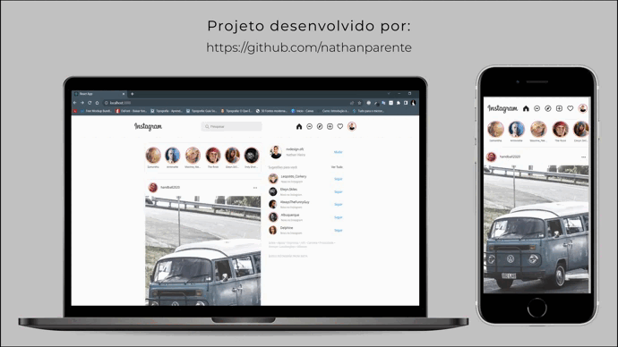

<h1 align="center">PROJETO INSTAGRAM COM REACT<h1>

# 📃 Description
  
(Eng) 
  This project was developed during the PARÇAS DEVELOPERS SCHOOL course and the main focus is on learning REACT JS to make the site work correctly. 
  
(Pt-br) 
  Este projeto foi desenvolvido durante o curso da PARÇAS DEVELOPERS SCHOOL e o principal destaque está no aprendizado do REACT JS para fazer o site funcionar corretamente. 

This project was bootstrapped with [Create React App](https://github.com/facebook/create-react-app).

 ### ⚙ Layout e Functions

## Available Scripts

In the project directory, you can run:

### `npm start`

Runs the app in the development mode.\
Open [http://localhost:3000](http://localhost:3000) to view it in your browser.

The page will reload when you make changes.\
You may also see any lint errors in the console.

Copyright © 2022 nathanparente

